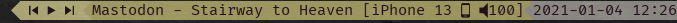
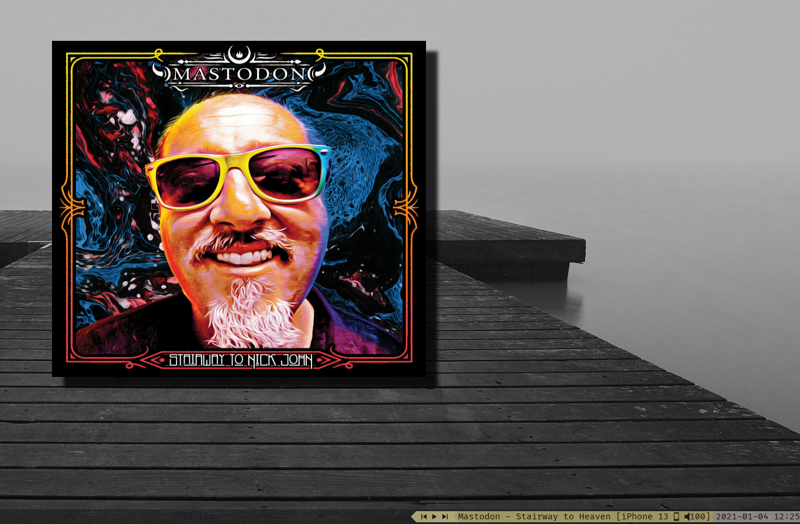

# spotify_remote

Example of usage is in [i3_module.sh](i3_module.sh)

Files CLIENT_ID and CLIENT_SECRET must conatin personal Id and Secret, [details](https://developer.spotify.com/)

[auth.sh](auth.sh) will generate an ACCESS_CODE

use dots_crypt_keys
